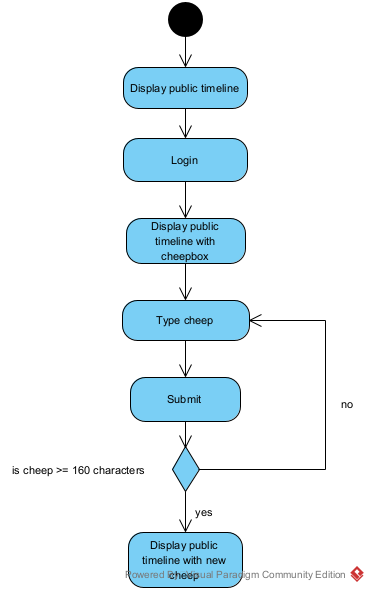
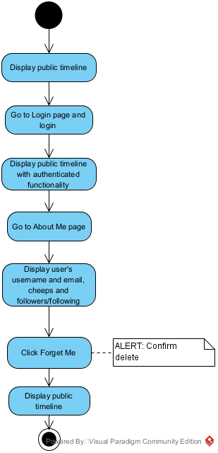
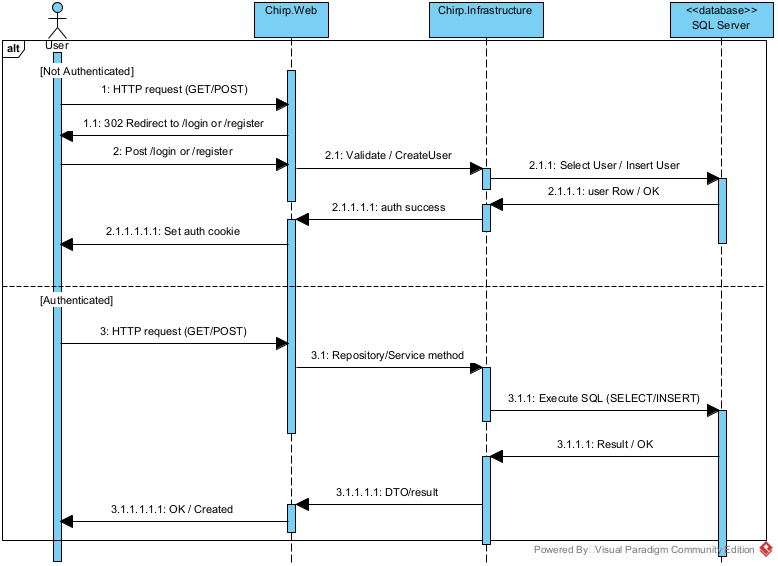
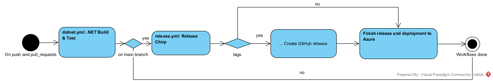
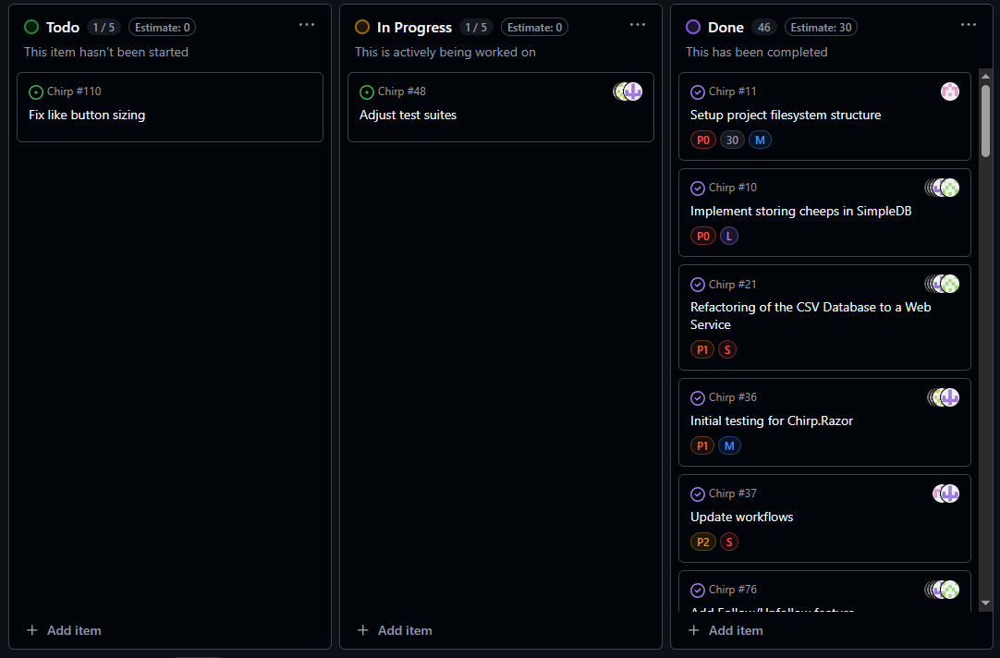
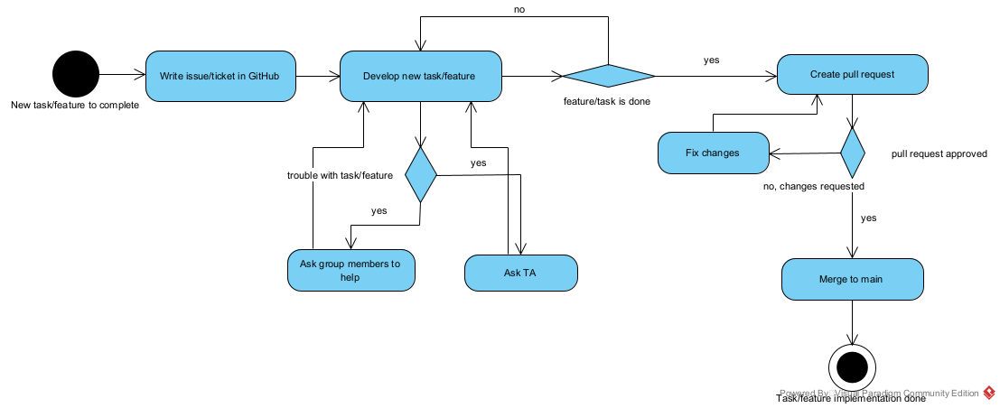

## Design and architecture

### Domain model
The illustration shows our domain model and its dependencies. The domain model is used by ASP .NET's EF Core package to construct a relational database in SQLite containing authors, the cheeps they write, and how to like cheeps. Moreover, the `Author` class depends on ASP .NET's Identity package, specifically it inherits from `IdentityUser`, including multiple fields such as `UserName`, `Email` and `Id`. We chose not to overwrite the `UserName` field from `IdentityUser` and used it as a display name in the application as well. \
This combination of Identity and EF Core allows our application to have users (`Author`) who can login, and see the cheeps they have written and more.\


### Architecture — In the small
We have implemented the onion architecture to structure our code, as it makes it easier to navigate between classes in different layers.\
Moreover, the code base itself is modeled after the repository pattern which helps us separate backend logic (domain model, database queries etc.) from frontend logic (layout, HTTP methods such as GET and POST etc.).

 \
The diagram above is a general and simplistic model of our onion architecture. We have also created a more detailed overview of the onion architecture in the following UML-diagram. \


### Architecture of deployed application
Our Chirp application is a client-server application, meaning clients send HTTP requests to the server, which is then responsible for rendering the web pages, updating and persisting data changes in the database and redirection of the client through the application when needed. Our webserver is hosted by Azure App Service. The illustration shows SQLite as a separate component which is probably a bit misleading. In reality our database is a `.db` file within our application, but we wanted to include the database when illustrating the deployed application.\


### User activities
**Register and Login** \
The model shows the progression of a non-authenticated user viewing the public timeline to logging in and gaining access to other features such as follow, unfollow, share cheeps and like functionality. The diagram shows the two different paths through either registration or login before being granted access to the features. \


**Create new Cheep** \
This illustration shows a client's journey from the `public timeline` as a non-authenticated user to an authenticated user which can post cheeps. A user can also post cheeps from the `user timeline` page but is not shown in the diagram.\


**About Me and Delete Me** \
The flow starts by displaying the `public timeline`. The user navigates to the `login page`  and logs in, after which the `public timeline` is shown again, now with authenticated functionality enabled. From there, the user can navigate to the `About Me` page, where their `username`, `email`, `cheeps` and `follower/following` counts are displayed. \
From the `About Me` page, the user can choose to use the `Forget Me` functionality. This action triggers a confirmation alert to prevent accidental deletion. Once the deletion is confirmed, the user account is removed and the application returns to displaying the `public timeline` in a non-authenticated state. \


### Sequence of functionality/calls through _Chirp!_
The illustration shows HTTP calls from a client to the web server for both authenticated and non-authenticated users. It shows how the different layers of the onion architecture work to retrieve, change and insert new data to the database. Moreover, it shows the separation of frontend and backend logic.\


## Process

### Build, test, release, and deployment
As seen in the illustration, the workflows are triggered on push and pull requests. It starts with the first workflow, `dotnet.yml`, which goes through basic steps such as restoring dependencies, building the project, installing Playwright and finishes with running unit and integration tests. The tests need to pass in order to achieve a successful workflow run. \
If the workflows are triggered on the `main` branch, GitHub Action runner will continue to `release.yml`. This workflow repeats restoring dependencies and building the solution. Afterwards it will prepare for deployment by publishing and uploading the web app. If the push is tagged, the workflow will also create a release. `release.yml` finishes by deploying the web app to Azure's App Service.\
 \
Our worflows ensure that no matter the branch, the code is always at least restored, built and tested when pushing to GitHub. Furthermore, we have configured our `release.yml` to only run on our `main` branch, meaning only production ready code was deployed to our Azure site. 

**Issues with workflows** \
We also made a workflow named `issue-labelling.yml`. The goal was to use the workflow to automatically move our issues across the project board, but we had issues making it work, and it was quickly discarded. We should have probably just deleted the workflow. \
Lastly, we encountered an issue with our `release.yml` workflow when we created a new tag, as Azure would not let us login if there were a tag. This is an Azure side error and not an error with the workflow itself. We decided not to try and fix it, as we encountered the error late in the semester, and without the tag it will deploy normally.

### Team work
**Handling of mandatory features/tasks in a group setting**\
We have tried to model our process in the shown activity diagram. Our process was fairly consistent throughout the semester. When a new task or feature was introduced in the lecture, a group member would start on the task by creating a ticket for the task, and would then continue trying to develop this new feature or complete the task. It felt pretty natural for the members in the group to take on tasks during the project, as other members still might be working on the weekly task prior. If there were issues with implementing a feature or completing a task, the person working on it, would usually ask help from the others in the group or ask a TA. When the task was done, a pull request was created and if approved, it would be merged to the `main` branch. Finally, the issue would be moved from In Progress to Done on the project board.


**Unresolved issues** \
We managed to implement all required functionality of the project including a wild style feature, which we chose to be a like function. An issue we did not manage to solve was the `Fix like button sizing` issue. As the project is now, whenever a cheep is longer than two lines, the like button will resize accordingly, leading to an inconsistent layout. \
Lastly, we had an old issue which is still open called `Adjust test suites`. It has remained open because the issue has been relevant throughout the semester, as we have continuously implemented new features which would need testing.


### How to make *Chirp!* work locally
In order to run our project locally follow these steps:
1. Firstly install the .NET SDK-version `.NET 8.0`.
2. Clone our Git repository from the terminal with:
```bash
git clone https://github.com/ITU-BDSA2025-GROUP26/Chirp.git
``` 
The folder should now contain (among other things): `src`, `test`,`Chirp.Razor.sln`.

3. To allow registering with GitHub `cd` into `src/Chirp.Web` and run the three following commands in your terminal:
```bash
dotnet user-secrets init
dotnet user-secrets set "authentication_github_clientId" "Ov23li8tJVPjkWxP3PA0"
dotnet user-secrets set "authentication_github_clientSecret" "dbb574deaac6b57c60ad2d322fd84b9caf22f83d"
```
4. To ensure HTTPS `cd` into `src/Chirp.Web` and run the following in your terminal: 
```bash
dotnet dev-certs https --trust
```
5. To run the project `cd` into `src/Chirp.Web` and from here, in the terminal run: 
```bash
dotnet run
```

After the last step there should be the following two links: 
- Now listening on: https://localhost:7102
- Now listening on: http://localhost:5273 

Pressing either of the links will redirect to the homepage of our application and use HTTPS. To close the application press Ctrl + C in the terminal window.

### How to run test suite locally
In our Chirp project we have a folder named `test` containing all our unit, integration and end-to-end tests. We have tried to structure our folders accordingly, meaning the projects folders are nested hierarchically. For example the `UnitTest` folder contains multiple folders named after the layer it is testing (core, infrastructure and web). The same goes for the `IntegrationTest` folder. \
Both unit and integration tests are made using XUnit, while the end-to-end tests are made using Playwright and NUnit.

To run the XUnit tests (unit and integration tests), the user needs `.NET 8.0`. To test single test projects `cd` into a test folder which contains a `.csproj` file, and then run:
```bash
dotnet test
```
For example to run the integration tests regarding our infrastructure, `cd` into `test/IntegrationTest/Chirp.InfrastructureTests` and then run `dotnet test`. 

To run the end-to-end tests, Playwright will firstly need to be installed:
1. `cd` into `test/PlaywrightTests/PlaywrightTest`
2. Run 
```bash
dotnet add package Microsoft.Playwright.NUnit --version 1.43.0
```
3. Build the project with
```bash
dotnet build
```
4. Finally run 
```bash
dotnet playwright install
```
To run the Playwright tests it is required that the project is running in its own terminal as well. First run the project with `dotnet run` in `src/Chirp.Web`. Afterwards in a new terminal `cd` into `test/PlaywrightTests/PlaywrightTest` and then run `dotnet test`.\
It is also possible to run all the tests in the project by executing `dotnet test` in the root directory containing the `Chirp.Razor.sln` file. This includes Playwright tests, but these will fail, if the program is not running in another terminal.

**Test suite** \
We have tried to regulary write tests for the features, that we have implemented throughout the project. This includes both unit tests, integration tests (using WebApplicationFactory from C#) and end-to-end tests. Moreover, we have tried to organise our tests, first into the type of test and then which layer of the onion architecture, the test class was testing. When running the code with dotCover in JetBrains Rider, it shows a coverage of 30%. This number should be higher, and next time we have to make a similar project, it will be a focus point to write more tests.


## Ethics

### License
We have chosen the MIT License for Chirp. The MIT License is a short and permissive license that provides a high degree of freedom in how the project can be used, modified and distributed.

When selecting a license, the group considered several options and used choosealicense.com as guidance. After evaluating the alternatives, the MIT License was chosen as it best matched the goals of the project. We also verified that all dependencies listed in the `.csproj` file are compatible with the MIT License.

The license file is located at `Chirp/LICENSE`.

### LLMs, ChatGPT, CoPilot, and others
One member of the group did not use any LLMs during development, while the remaining group members did. LLMs were primarily used as a support tool for tasks such as debugging code (both logical erros and syntax issues), understanding error messages, and generating or validating CLI commands.

LLMs were also used to assist with code syntax in specific cases. For example, when writing Playwright tests for the login and registration functionality, we encountered an issue where the compiler could not distinguish between the `Password` and `Confirm password` fields. An LLM helped resolve this by suggesting a corrected syntax that fixed the issue.

Additionally, GitHub Actions was used to generate CI workflows based on the repository structure and project requirements. This process involved GitHub Copilot, after which the generated workflows were manually reviewed and adjusted to better match our needs.\
GitHub Copilot also made suggestions and gave feedback to some of our commits and issues.

Overall, LLMs proved to be helpful in the scenarios described above and significantly sped up development by reducing time spent on debugging and configuration. However, they were used strictly as a complementary tool, as LLM-generated responses can occansionally be incorrect and therefore require critical evalutation.

The LLMs used in this project were:
- ChatGPT
- GitHub Copilot
- Claude